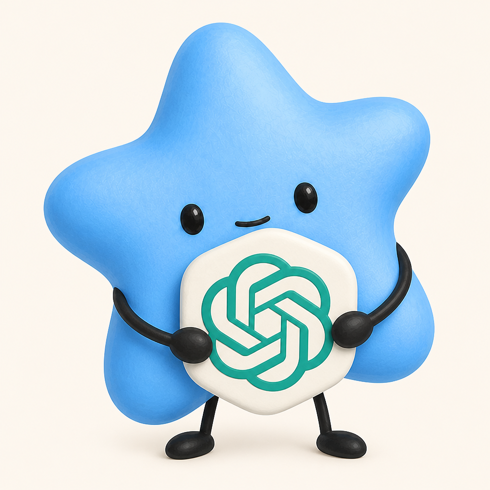

<p align="center">
  
</p>

# Viewfy 💙 GPT Ads

One business domain → an editable business map → competitor research → ad concepts → a ChatGPT ad creative. Confirm your map before research starts.

**Built with Astra.** React + Vite frontend, FastAPI backend.

[Open Viewfy](https://ads.viewfy.ai) · [Explore the imagined designs](docs/design-concepts.md)

## Run locally

```bash
cp .env.example .env
python3 -m venv .venv
source .venv/bin/activate
pip install -r backend/requirements.txt
npm ci --prefix frontend

# Terminal 1, from the repository root
.venv/bin/uvicorn app:app --app-dir backend --host 127.0.0.1 --port 9410

# Terminal 2, from the repository root
npm --prefix frontend run dev
```

Open [localhost:5173](http://localhost:5173) and try `getsuperagent.com`.

Superagent opens its reviewed business map and public-channel snapshot immediately. It does not start a new crawl or add a simulated loading delay. Other domains use the live website-reading flow.

## Campaign launch

Campaign submission is paused by default (`LIVE_CAMPAIGN_SUBMISSION_ENABLED=0`). The primary action saves the setup and continues to Next Steps without requiring an account connection or submitting ads. The server also defers requests to `/launch` from older pages, preserving the saved campaign and creative. Live submission requires explicitly enabling `LIVE_CAMPAIGN_SUBMISSION_ENABLED=1`; this does not change the current website’s save-and-continue flow.

Research and generation use live integrations by default (`MOCK=0`). Add server-side keys to `.env`: `OPENAI_API_KEY` for text/images and `APIFY_TOKEN` for Meta + Google ad research. `OPENAI_ADS_API_KEY` configures the Ads Manager account for future live submission.

See [the research notes](docs/research/README.md) for coverage, advertiser identity, source limitations, and rebuilding the snapshot. Missing activity and performance data remain unknown; generated campaign concepts are separate from observed ads.

For development, `MOCK=1` selects fixture-backed research and creative generation; it does not enable campaign submission. Automated launch tests stub the network explicitly. See [.env.example](.env.example) for optional settings.
