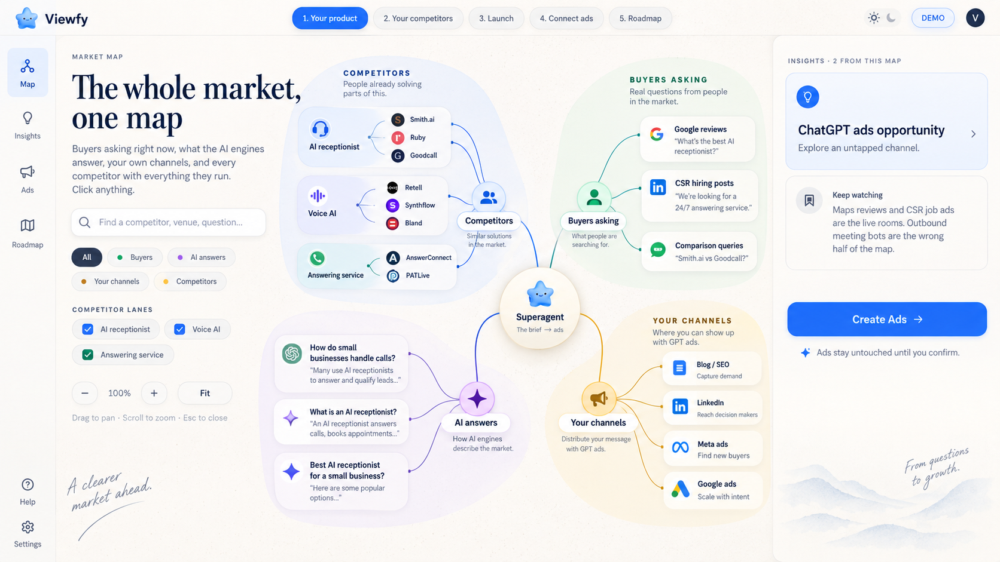
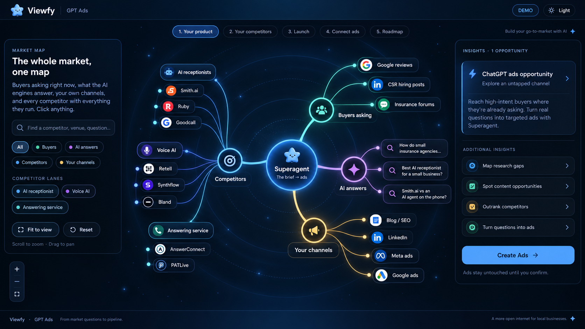
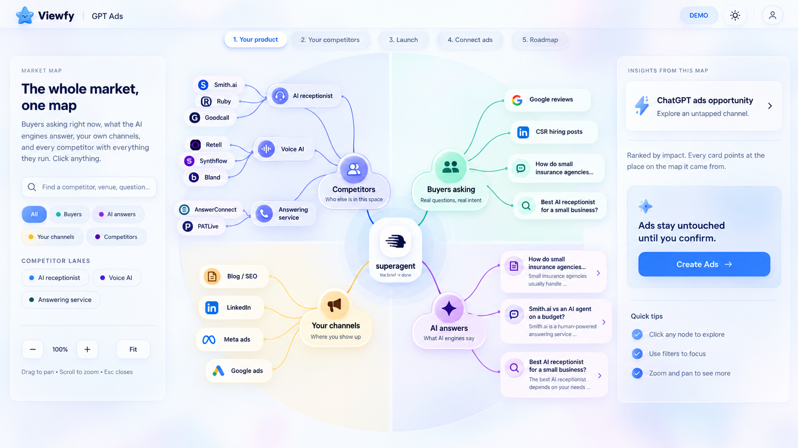
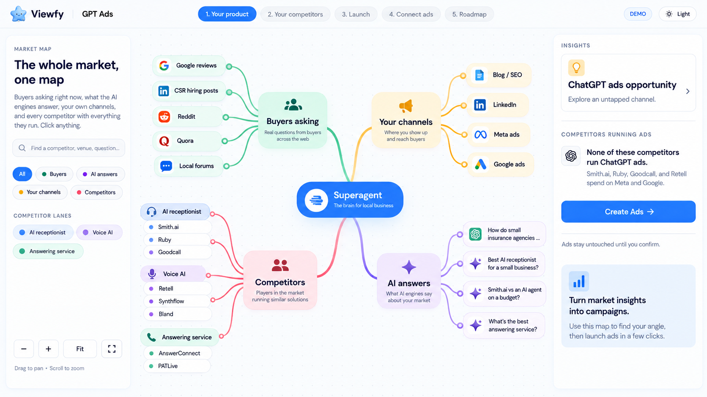
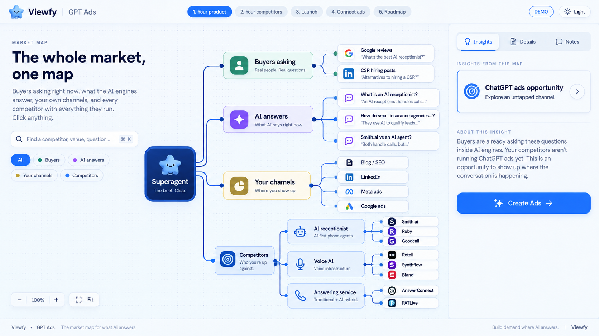

# Five business mindmap concepts

Image-to-image explorations of the existing Viewfy business mindmap, using the same Superagent demo structure. These are visual concepts, not implemented screens.

## 1. Editorial Atlas

Warm ivory, ink-blue branches and calm editorial typography.

## 2. Midnight Constellation

Midnight navy, luminous connections and spacious orbital clusters.

## 3. Prismatic Glass

Pearl-white canvas, frosted cards and subtle blue-lavender depth.

## 4. Playful Studio

Friendly pastel clusters, confident rounded branches and a creative canvas.

## 5. Precision Blueprint

A structured horizontal graph with aligned lanes and precise connectors.

[Original screenshot](./source-mindmap.png) · [Exact generation prompts](./prompts.md)

Generated with the built-in image_gen tool.

